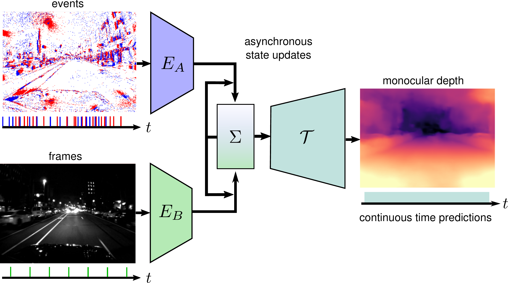

# Combining Events and Frames using Recurrent Asynchronous Multimodal Networks for Monocular Depth Prediction
<p align="center">

</p>

This is the code for the paper **Combining Events and Frames using Recurrent Asynchronous Multimodal Networks for Monocular Depth Prediction** by
[Daniel Gehrig*](https://danielgehrig18.github.io/), Michelle Rüegg*, Mathias Gehrig, [Javier Hidalgo-Carrió](https://jhidalgocarrio.github.io), and [Davide
Scaramuzza](http://rpg.ifi.uzh.ch/people_scaramuzza.html):

You can find a pdf of the paper
[here](http://rpg.ifi.uzh.ch/docs/RAL21_Gehrig.pdf) and the project homepage [here](http://rpg.ifi.uzh.ch/RAMNet.html). If you use this work in an academic context, please cite the following publication:

```bibtex
@Article{RAL21Gehrig,
  author        = {Daniel Gehrig, Michelle Rüegg, Mathias Gehrig, Javier Hidalgo-Carrio and Davide Scaramuzza},
  title         = {Combining Events and Frames using Recurrent Asynchronous Multimodal Networks for Monocular Depth Prediction},
  journal       = {{IEEE} Robotic and Automation Letters. (RA-L)},
  url           = {http://rpg.ifi.uzh.ch/docs/RAL21_Gehrig.pdf},
  year          = 2021
}
```

If you use the event-camera plugin go to [CARLA](https://carla.readthedocs.io/en/latest/ref_sensors/#dvs-camera), please cite the following publication:

```bibtex
@Article{Hidalgo20threedv,
  author        = {Javier Hidalgo-Carrio, Daniel Gehrig and Davide Scaramuzza},
  title         = {Learning Monocular Dense Depth from Events},
  journal       = {{IEEE} International Conference on 3D Vision.(3DV)},
  url           = {http://rpg.ifi.uzh.ch/docs/3DV20_Hidalgo.pdf},
  year          = 2020
}
```

## Install with Anaconda

The installation requires [Anaconda3](https://www.anaconda.com/distribution/).
You can create a new Anaconda environment with the required dependencies as
follows (make sure to adapt the CUDA toolkit version according to your setup):

```bash
conda create --name RAMNET python=3.7
conda install pytorch torchvision torchaudio cudatoolkit=10.2 -c pytorch
pip install tb-nightly kornia scikit-learn scikit-image opencv-python
```
## Branches

To run experiments on Event Scape plese switch to the `main` branch

    git checkout main
    
To run experiments on real data from MVSEC, switch to `asynchronous_irregular_real_data`.

    git checkout asynchronous_irregular_real_data

## Checkpoints

The checkpoints for RAM-Net can be found here:
* [trained on EventScape](http://rpg.ifi.uzh.ch/data/RAM_Net/checkpoints/ramnet_sim.pth.tar)
* [trained on MVSEC](http://rpg.ifi.uzh.ch/data/RAM_Net/checkpoints/ramnet_sim2real.pth.tar)

## EventScape

This work uses the EventScape dataset which can be downloaded here:

* [Training Set (71 Gb)](http://rpg.ifi.uzh.ch/data/RAM_Net/dataset/Town01-03_train.zip)
* [Validation Set (12 Gb)](http://rpg.ifi.uzh.ch/data/RAM_Net/dataset/Town05_val.zip)
* [Test Set (14 Gb)](http://rpg.ifi.uzh.ch/data/RAM_Net/dataset/Town05_test.zip)


<p align="center">
    
</p>

## Qualitative results on MVSEC
Here the qualitative results of RAM-Net against state-of-the-art is shown.
The video shows MegaDepth, E2Depth and RAM-Net in the upper row, image and event inputs and depth ground truth in the lower row.


<p align="center">
    
</p>


## Using RAM-Net
A detailed description on how to run the code can be found in the README in the folder `/RAM_Net`. Another README can be found in `/RAM_Net/configs`, it describes the meaning of the different parameters in the configs.
